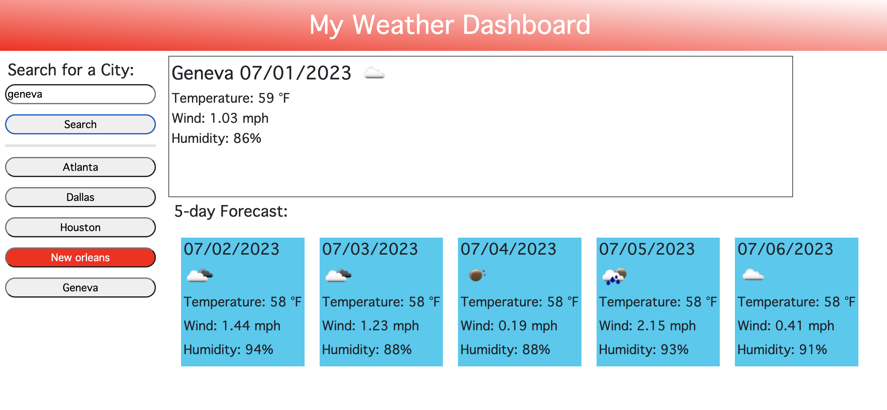

# what-is-the-weather

## Description

### What was our motivation?

- I have been hired to build a weather dashboard that will run in the browser and feature dynamically updated HTML and CSS. The company would like me to use the [5 Day Weather Forecast](https://openweathermap.org/forecast5) to retrieve weather data for cities. The base URL should look like the following: `https://api.openweathermap.org/data/2.5/forecast?lat={lat}&lon={lon}&appid={API key}`.

### Why did we build this project?

- I built this project to showcase my ability to use APIs and local storage. 

### What did we learn? 

- In this project I learned how to create a web application that displays a five day weather forcast using the customer's requested API. 
    
 
## User Story
```
AS A customer
I WANT to see the weather outlook for multiple cities
SO THAT I can plan a trip accordingly
```


## Acceptance Criteria
```
GIVEN a weather dashboard with form inputs
WHEN I search for a city
THEN I am presented with current and future conditions for that city and that city is added to the search history
WHEN I view current weather conditions for that city
THEN I am presented with the city name, the date, an icon representation of weather conditions, the temperature, the humidity, and the wind speed
WHEN I view future weather conditions for that city
THEN I am presented with a 5-day forecast that displays the date, an icon representation of weather conditions, the temperature, the wind speed, and the humidity
WHEN I click on a city in the search history
THEN I am again presented with current and future conditions for that city
```

## Mock-Up

The following shows a sample of the web application's appearance:



## Deployment 

Deployed application can be found at
